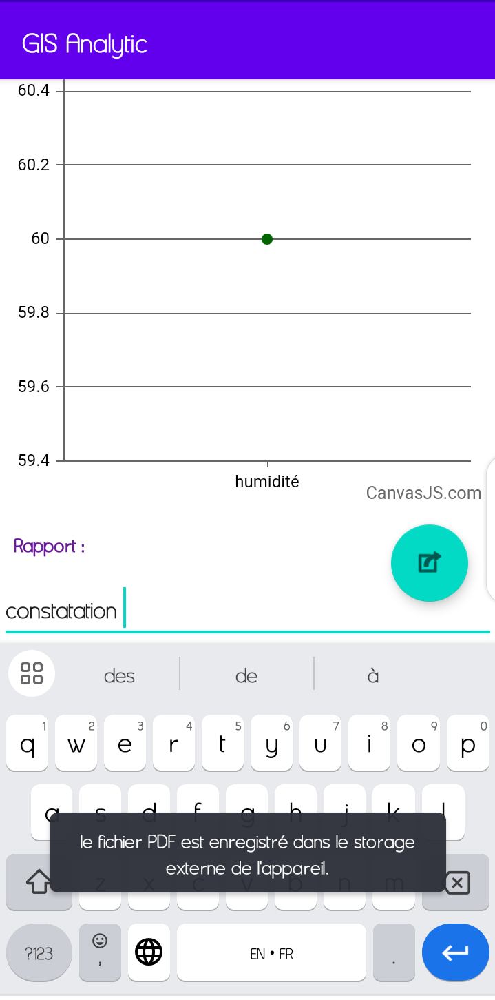

# 👋 Hi there!

I'm a passionate Software Engineer with a degree in Software Engineering, specializing in Software Architecture, and a Bachelor's degree in Information Systems with a focus on Embedded Systems.

## 💻 Web Development
I have over 3 years of experience in web development, where I have successfully delivered a variety of projects, including:

- **E-commerce Websites**: Developed robust and scalable e-commerce platforms, implementing features such as product catalogs, shopping carts, payment gateways, and user account management to enhance the online shopping experience.
  
- **Blogging Platforms**: Created user-friendly blogging systems that allow users to publish, edit, and manage their content easily. Implemented features like comment sections, tagging, and social media sharing to increase user engagement.

- **Private Messaging Systems**: Built secure and real-time private messaging applications, enabling users to communicate seamlessly. Focused on user authentication, message encryption, and notifications to ensure a smooth user experience.

- **API Development**: Designed and developed RESTful APIs to facilitate communication between front-end and back-end systems. Ensured that APIs are well-documented and follow best practices for security and performance.

My expertise includes working with frameworks like Symfony, Laravel, Vue.js, and Angular, as well as backend technologies such as .NET Core and Java EE. I am committed to delivering high-quality, maintainable code and continuously improving my skills through hands-on experience and learning.

## 📱 Mobile Development
I have experience in mobile development using Flutter and Android Java, where I have developed various applications, including:

- **User Identity Verification System**: Implemented secure and efficient user authentication processes.
  
- **Chatting Rooms**: Created real-time messaging applications for seamless communication.
  
- **Carpooling Management App**: Developed a platform to facilitate carpooling arrangements among users.
  
- **Various Other Projects**: Worked on numerous freelance projects, enhancing my skills in delivering user-friendly mobile solutions.

## 🤖 AI & Machine Learning
I possess a strong foundation in AI and machine learning, with experience in Recurrent Neural Networks (RNN), Convolutional Neural Networks (CNN), and Natural Language Processing (NLP).

## 📊 Data Engineering
Additionally, I have extensive experience in data engineering and database management, working with Oracle, PostgreSQL, and MySQL.

## 🌟 Let's Connect!
I'm always eager to learn and collaborate on innovative projects.

## 🖼️ Sample of My Works

    

        <h4>File Uploader Plugin: VueJS 3</h4>
        

            
        

    

    

        <h4>ERP Module: Missions Management: Angular + .Net Core</h4>
        

<!--             
 -->
                
<!--             
 -->
<!--             
 -->
                
<!--             
 -->
<!--             
 -->
                
<!--             
 -->
<!--             
 -->
                
<!--             
 -->
<!--             
 -->
                
<!--             
 -->
        

    

    

        

            <h4>Users feed-backs(comments) analyser: VueJS 3 + Laravel + NLP</h4>
        

        

            
        

    

    

        <h4>E-commerces samples</h4>
        

            

                
            

            

                
            

            

                
            

        

    

    

        <h4>GIS Management Mobile App: Android Java</h4>
        

            
            
            
            
            
            
            
            
        

    

    

        

            <h4>Mobile KYC System: Flutter</h4>
            <video controls>
                <source src="Demo.mp4" type="video/mp4">
                Your browser does not support the video tag.
            </video>
        

        

            <h4>WhatsApp Mini Project: ReactNative</h4>
            <video controls>
                <source src="Demo.webm" type="video/webm">
                Your browser does not support the video tag.
            </video>
        

    

